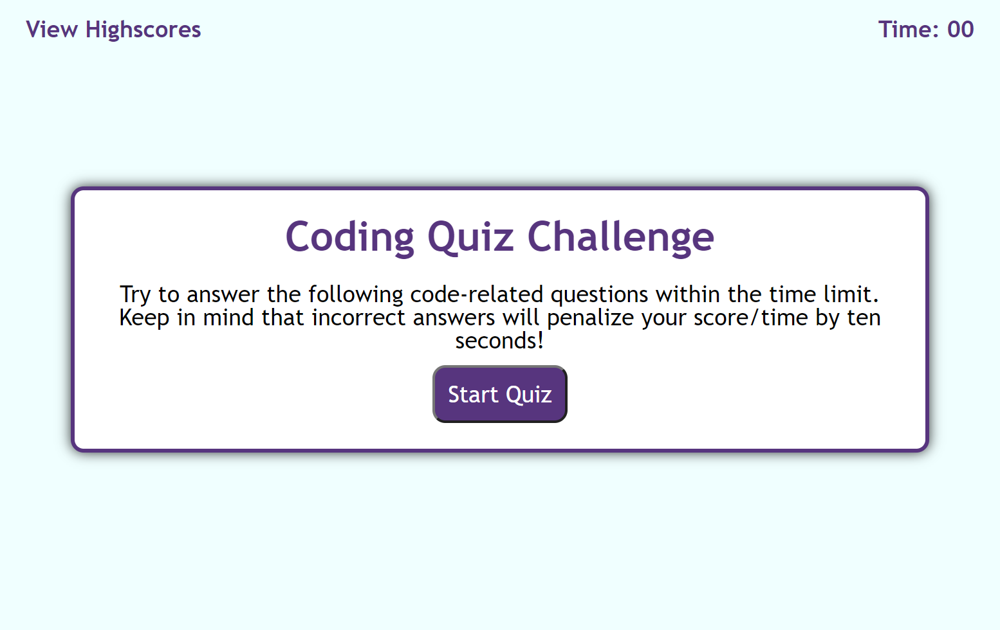
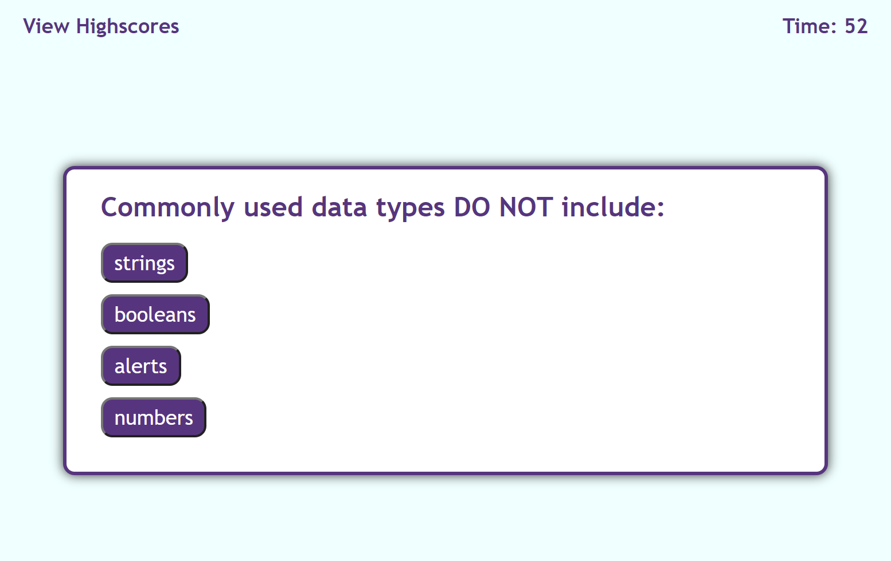
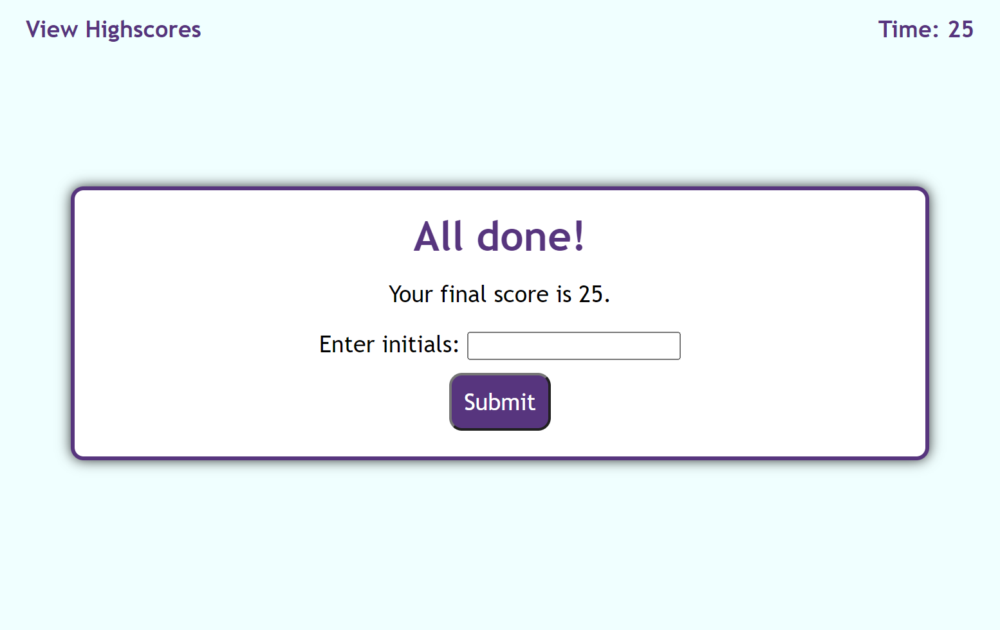
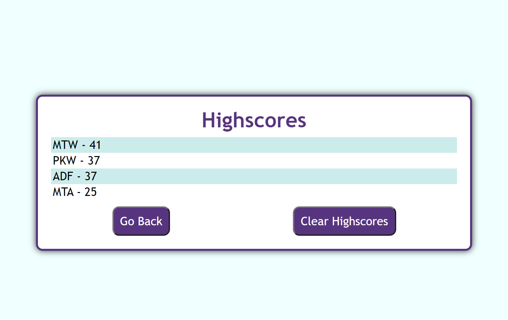
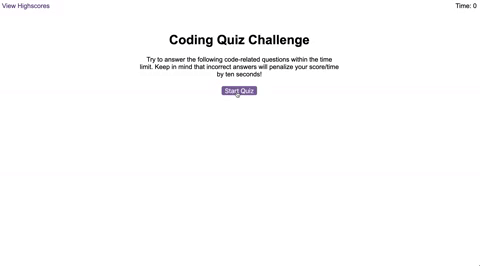

# M4-Code-Quiz

## Description

This application is a quiz that determines your score based on your final time. Every time you choose an incorrect answer the timer descends by 10 seconds. It is primarily built on JavaScript. The purpose of this project was to learn to implement API's and advanced JS.
While building this project I learned how to:

- Run a timer
- Save a JSON file to local storage and pull its contents on another webpage
- Use CSS to style every n'th child
- Select elements by ID and create children elements
- Use CSS: "display: none;" in order to hide divs and use JavaScript: ".classList.add() and .classList.remove()" to add and remove said class

## Link to Deployed Site

To view the project click here: [Code Quiz](https://mateo-wallace.github.io/M4-Code-Quiz/index.html)

## Screenshots






## Assignment Instructions

### User Story

```
AS A coding boot camp student
I WANT to take a timed quiz on JavaScript fundamentals that stores high scores
SO THAT I can gauge my progress compared to my peers
```

### Acceptance Criteria

```
GIVEN I am taking a code quiz
WHEN I click the start button
THEN a timer starts and I am presented with a question
WHEN I answer a question
THEN I am presented with another question
WHEN I answer a question incorrectly
THEN time is subtracted from the clock
WHEN all questions are answered or the timer reaches 0
THEN the game is over
WHEN the game is over
THEN I can save my initials and my score
```

### Mockup Image



## Credits

Rana, M. (2020, November 16). JavaScript countdown 1 minute timer. codepen.io. Retrieved October 6, 2022, from https://codepen.io/masudrana2779/details/GRqzPdZ 

Web Dev Simplified. (2019, June 15). Build a Quiz App with JavaScript. YouTube. Retrieved October 6, 2022, from https://www.youtube.com/watch?v=riDzcEQbX6k&amp;list=PLv2eRoPT92sJKSJPF_XKixhmAUU8P2JbW&amp;index=1 

## License

### MIT License

Copyright (c) 2022 Mateo Wallace

Permission is hereby granted, free of charge, to any person obtaining a copy
of this software and associated documentation files (the "Software"), to deal
in the Software without restriction, including without limitation the rights
to use, copy, modify, merge, publish, distribute, sublicense, and/or sell
copies of the Software, and to permit persons to whom the Software is
furnished to do so, subject to the following conditions:

The above copyright notice and this permission notice shall be included in all
copies or substantial portions of the Software.

THE SOFTWARE IS PROVIDED "AS IS", WITHOUT WARRANTY OF ANY KIND, EXPRESS OR
IMPLIED, INCLUDING BUT NOT LIMITED TO THE WARRANTIES OF MERCHANTABILITY,
FITNESS FOR A PARTICULAR PURPOSE AND NONINFRINGEMENT. IN NO EVENT SHALL THE
AUTHORS OR COPYRIGHT HOLDERS BE LIABLE FOR ANY CLAIM, DAMAGES OR OTHER
LIABILITY, WHETHER IN AN ACTION OF CONTRACT, TORT OR OTHERWISE, ARISING FROM,
OUT OF OR IN CONNECTION WITH THE SOFTWARE OR THE USE OR OTHER DEALINGS IN THE
SOFTWARE.
